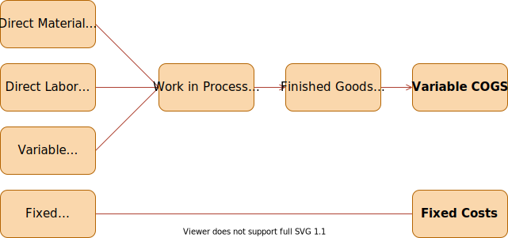

## Session 01 - Part II <br> Product Costing

### Outline (1/3)
Cost Inclusion

- Full Costing.
- Variable Costing.

What manufacturing items are charged to products?

### Outline (2/3)

Cost measures

- Actual Costing.
- Normal Costing.
- Standard Costing.

What dollar amounts are charged for these items?

### Outline (3/3)
Cost Accumulation

- Job Order Costing.
- Process Costing.

How are the dollar charges accrued and assigned to individual products?

## Cost Inclusion

### Full Costing

Assign all manufacturing costs to a product (all __Product Costs__).

Full costing includes both __fixed__ and __variable__ manufacturing overhead.

Also referred to as *Full Absorption Costing*.

Standard for calculating Cost of Goods Sold \(COGS\) in financial reporting.

### Full Costing

{width=100%}

### Full Costing – Income Statement
-------- -----------------------
            Sales Revenue
   -        Cost of Good Sold
 __=__      __Gross Margin__
   -        Non-manufacturing cost (SG&A)
 __=__      __Operating Profit__
--------------------------------

### Variable Costing
Considers what is not assigned to a product (__Period Costs__)

Variable costing separates fixed and variable overheads

Preferred for internal reports
  - Takes into account the variable SG&A

### Variable Costing

{width=100%}

### Variable Costing – Income Statement
------ -----------------------
        Sales Revenue
  -     Variable COGS
  -     Variable SG&A
__=__   __Contribution Margin__
  -     Fixed Manufacturing Cost
  -     Fixed Non-manufacturing cost
__=__   __Operating Profit__
-------------------------------

### Example -- Full Costing {data-transition="convex-in none-out"}

                                                    Type
------------------------------------- ----------- ---------
Administrative Costs                    44,300      SG&A
Manufacturing Building Dep.             27,000      OH
Indirect Material and Supplies          6,300       OH
Sales Commissions                       15,200      SG&A
Direct Material                         21,700      DM
Direct Labor                            35,600      DL
Supervisory and Indirect Labor          14,400      OH
Property taxes, manufacturing plant     8,400       OH
Plant, Utilities and Power              23,500      OH
Sales Revenue                           210,400  
-----------------------------------------------------------

### Example -- Full Costing {data-transition="none-in none-out"}
Let’s aggregate all of this

Type
----------------------------- -----------
Direct Labor                    35,600
Direct Material                 21,700
Manufacturing OH                79,600
Non-manufacturing OH (SG&A)     59,500
-----------------------------------------

### Example -- Full Costing {data-transition="none-in convex-out"}
Income Statement with Full Costing

----------------------------- ------------
Sales                           210,400
Cost of Goods Sold              136,900
__Gross Margin__                __73,500__
SG&A                            59,500
__Net Income Before Taxes__     __14,000__
------------------------------------------

::: incremental
- Income Statement with Variable Costing?
  - We would need to separate OH into fixed and variable components
:::

### Example -- Full and Variable Costing {data-transition="convex-in none-out"}

A furniture company produced 400 chairs during March 2019 and sold 300 of them.

Costs
-------------------------- -------
Manufacturing OH (fixed)    9,000
Labor                       7,000
Materials                   5,000
SG&A (fixed)                1,000
Selling Price               60
------------------------------------

### March 2019 Income – Full Costing {data-transition="none-in none-out"}

-------------------------- -----------
Sales Revenue               18,000
COGS (300/400)*21,000       15,750
__Gross Margin__            __2,250__
SG&A                        1,000
__Income__                  __1,250__
--------------------------------------

### March 2019 Income – Variable Costing {data-transition="none-in convex-out"}

--------------------------------- ----------
Sales Revenue                       18,000
Variable COGS (300/400)*12,000      9,000
Variable SG&A                       0
__Contribution Margin__             __9,000__
Fixed OH                            9,000
Fixed SG&A                          1,000
__Income__                          __(1000)__
---------------------------------------------

### Full vs Variable Costing

::: incremental

- What happened ?!
    - In Full Costing, the total cost was made proportional to sales
    - In Variable Costing, only the variable cost was made proportional to sales
- Full costing method yields higher income when production is greater than sales

:::

## Cost Measures

### Cost Measurements

Actual Costing

Normal Costing

Standard Costing

### Actual Costing {data-transition="convex-in none-out"}

Allocate OH after all overhead costs are known (e.g. at the end of the year).

Applied Cost = Actual DM + Actual DL + Actual Var. OH + Actual FOH if Full Costing

Actual Var. OH = __VOH rate__ x Volume of driver for product

$$\text{VOH rate} = \frac{\text{Actual OH Costs}}{\text{Volume of Driver of OH used in production}}$$

- Examples of volume of driver:
    - DL dollars.
    - DL hours.

### Actual Costing {data-transition="none-in convex-out"}

::: incremental
- Precise product cost (use actual costs)
- Information lag
    - Allocate overhead __after__ all the costs are known
:::

### Normal Costing {data-transition="convex-in none-out"}
Approximate the product costs

Cost = Actual DM + Actual DL + Normal Var. OH + Normal FOH if Full Costing

Normal Var. OH = __Predicted VOH rate__ x Actual activity level

$$\text{Estimated OH Costs} = \frac{\text{Predicted VOH rate}}{\text{Estimated activity level of driver}}$$


### Normal Costing {data-transition="none-in convex-out"}

::: incremental
- Only gives an approximation
- Difficult to set the rates
    - Need extra record\-keeping
- Information lag reduced compared to actual costing
    - No need to wait for the end of the year to have a weekly or monthly estimate
:::

### Standard Costing {data-transition="convex-in none-out"}

Uses predetermined costs for all aspects of the product

[Cost = Std. DM + Std. DL + Std. VOH + Std. FOH if Full Costing]{.center-horizontal}

Std. DM = Std. DM cost ∗ Std. amount of DM per unit ∗ actual # of units produced

Std. DL = Std. DL cost ∗ Std. amount of DL per unit ∗ actual # of units produced

\

Std. VOH = Std. VOH cost ∗ Std. amount of VOH per unit ∗ actual # of units produced

Std. FOH = Std. FOH cost ∗ Std. amount of FOH per unit ∗ actual # of units produced

### Standard Costing {data-transition="none-in convex-out"}

- Imprecise product costs
- Difficult to set standards
- No information lag problem

\

- Used mostly in planning and control
- Performance evaluation mechanism

### Actual VS Normal VS Standard Costings
+-------------------+-------------------+-------------------+-----------------------+
|                   | Actual            | Normal            | Standard              |
+===================+===================+===================+=======================+
| Direct Costs      | Actual Rate\      | Actual Rate\      | __Standard Rate__\    |
|                   | Actual Input\     | Actual Input\     | __Standard Input__\   |
|                   | Actual Units      | Actual Units      | Actual Units          |
+-------------------+-------------------+-------------------+-----------------------+
| Indirect Costs    | Actual Rate\      | __Budgeted Rate__\| __Standard Rate__\    |
|                   | Actual Input\     | Actual Input\     | __Standard Input__\   |
|                   | Actual Units      | Actual Units      | Actual Units          |
+-------------------+-------------------+-------------------+-----------------------+


### Example {data-transition="convex-in none-out"}

- A company manufactures chairs and incurs the following costs
    - Direct Material: wood, foam, fabric, …
    - Direct Labor
    - Variable OH: power, indirect supervisory labor…
    - Fixed OH: depreciation …
- VOH is allocated on the basis of DL Hours (DLH)
- FOH is allocated on the basis of DL Dollars

### Example {data-transition="none-in none-out"}
The costs are

```table
---
alignment: LCC
markdown: True
csv-kwargs:
    delimiter: ';'
---
                ;Estimate               ;Actual
VOH             ;$8 per DLH             ;$2,080
FOH             ;$600                   ;$900
DL Hours        ;200 hours              ;210 hours
DL Dollars      ;$11.25 per hour        ;$ 3,778
DM              ;$2,005                 ;$2,005
Output          ;100 Chair              ;100 Chairs
```

- What is the unit cost under
    - Actual and Normal Costing?
    - Note: We are using Full Absorption Costing.

### Example {data-transition="none-in none-out"}
Predicted FOH Rate for Normal Costing:
$\frac{600}{200*11.25} = 0.267$

                            Actual Costing     Normal Costing             Difference from Actual
-------------------------  ------------------ -------------------------- -------------------------
DM                          $2,005             $2,005
DL                          $3,778             $3,778
VOH                         $2,080             (\\$8*210) $1,680          Under-applied ($400)
FOH                         $900               (0.267*\\$3,778) $1,007    Over-applied $107
__Total Costs__             __$8,763__         __$8,470__                 
\# Units Produced           100                100                        
Unit Cost                   $87.63             $84.70                     
Net adjustment to COGS                                                    $293
--------------------------------------------------------------------------------------------------

### Example {data-transition="none-in convex-out"}
How about Standard Costing?

+-----------------------+---------------------------+-----------------------+
| Standard Cost of DM   | Wood\                     | \\$2 per sq.ft.\      |
|                       | Fabric / Foam             | $1 per yard           |
+-----------------------+---------------------------+-----------------------+
| Standard Amount of DM | Wood\                     | 10 sq.ft.\            |
|                       | Fabric / Foam             | 8 yards               |
+-----------------------+---------------------------+-----------------------+
| Standard DL Rate      |                           | $11.25 per hours      |
+-----------------------+---------------------------+-----------------------+
| Standard VOH Rate     |                           | $8 per DL hours       |
+-----------------------+---------------------------+-----------------------+
| Standard FOH Rate     |                           | $0.267 per DL hours   |
+-----------------------+---------------------------+-----------------------+
| Standard DL per chair | (200 hours / 100 chairs)  | 2 hours               |
+-----------------------+---------------------------+-----------------------+

What is the standard cost for one chair using Full Costing?

## Cost Accumulation

### Cost Accumulation

* Defines the granularity of the information reported in the costing system
* Two main methods
  * Job Costing
  * Process Costing

### Job Costing

* Job Costing defines a costing system for each individual product
* It charges separate WIP \(Work In Progress\) account for each “Job”
* For example
  * Individual costing for Planes\, a given Advertising Campaign\, Legal Cases\, …

### Job Costing - Example

* Let us consider a plane manufacturer
* Each plane has a separate WIP account
* As of now\, the accounting system includes 3 planes
  * Plane 1 is sold
  * Plane 2 is in process
  * Plane 3 is finished but not sold
* On the balance sheet we would have
  * Work In Progress: WIP of plane 2
  * Finished Good Inventory: COGM from plane 3 \(COGM=Cost Of Good Manufactured\)\)
  * COGS: COGM from plane 1

### Process Costing {data-transition="convex-in none-out"}

Process Costing aggregates all manufacturing costs together and divides by one measure of production

Considers a mass of similar units

Spreads the total cost over the number of units produced during the period

### Process Costing {data-transition="none-in convex-out"}
How to track what is produced?

Units produced = Complete units + f(incomplete units)

- f(.) can be assumed: for example, assume that each incomplete unit is 50% complete.
- Or need to determine the stage of completion for each account (DM, DL, OH) separately.

### Process Costing - Example {data-transition="convex-in none-out"}

Suppose that
- 20,000 units are completed.
- 5,000 units are in process at the end of the period.

What is the value of the ending FG (Finished Goods) inventory and the WIP (Work In Process) inventory?

### Process Costing - Example {data-transition="none-in none-out"}
Assume that each incomplete unit is 50% complete

---------------------------------- --------- -------------------------
\# of equivalent units completed      22,500  20,000 + 50% * 5,000
Cost per equivalent unit               $9.33  210,000 / 22,500
COGM                                $186,667  20,000 * $9.33
WIP                                  $23,333  2,500 * $9.33
----------------------------------------------------------------------

### Process Costing - Example {data-transition="none-in none-out"}
Assume now that

- All units are completed with respect to DM
- And are 50% complete with respect tolabor

---------------------------------------- -----------   --------------------------------------
\# of equivalent units completed (DM)         25,000    20,000 + 100% * 5,000
Cost of DM per equivalent unit                    $4    $100,000 / 25,000
\# of equivalent units completed (DL)         22,500    20,000 + 50% * 5,000
Cost of DL per equivalent unit                 $2.22    $50,000 / 22,500
\# of equivalent units completed (OH)         22,500    20,000 + 50% * 5,000
Cost of OH per equivalent unit                 $2.67    $60,000 / 22,500
COGM                                        $177,800    20,000 * (\\$4 + \\$2.22 + $2.67)
WIP                                          $32,200    5,000 * \\$4 + 2,500 * (\\$2.22 + $2.67)
-----------------------------------------------------------------------------------------

## Takeaways

### Takeaways {data-transition="convex-in none-out"}

::: incremental
- Managerial accounting is not bound by standards (GAPP).
    - Full Costing is the method used for financial statements.
    - But we can generate more interesting breakdown of the costs with Variable Costing

- How to allocate the costs is not trivial.
    - Do I want to be precise but need to wait until the end of the year to analyze data?
    - Or do I accept to be imprecise while allowing me more frequent tracking?
:::

### Takeaways {data-transition="none-in none-out"}

::: incremental
- Does my business need individual units of production to be independently assessed?
    - If so, Job Costing is the answer
    - But what are the data and accounting system requirements needed?
:::

. . .

No perfect solution, just multiple trade-offs.
