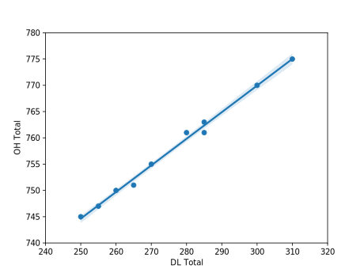
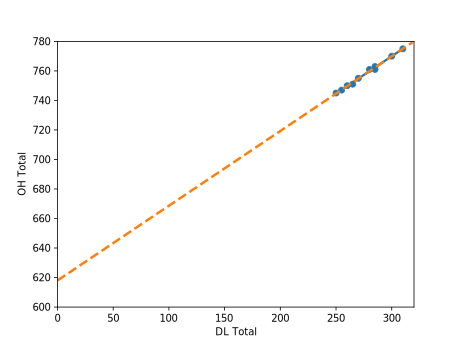
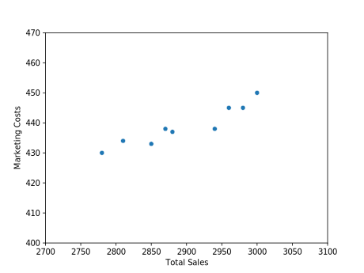
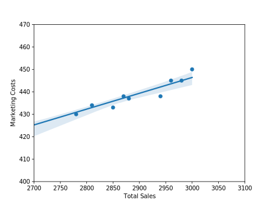

## Session 02 <br> Cost-Volume Profit

### Outline
::: incremental
- Estimating Cost Functions.
- CVP Analysis:
  - Breakeven Analysis.
  - Sensitivity Analysis.
  - Operating Leverage.
:::

## Estimating Cost Functions

### Cost Behavior

{width=70%}

### How to estimate the cost functions? {data-transition="convex-in none-out"}
Assume that costs are linear:

[Total Cost = Fixed Costs + Variable Costs ∗ Activity Level]{.center-horizontal}

- Standard Cost Method.
  - Gather information and estimate.
- Analysis of individual cost items.
- Visual fit.
  - Scatter plot.

### How to estimate the cost functions? {data-transition="none-in none-out"}

Regression Analysis

$$ Y_t = \beta_0 + \beta_1 X_{1,t} + \varepsilon_t$$

::: incremental
- $Y_t$: Dependent variable (Cost).
- $X_{1,t}$: Independent variable.
- $\beta_0$: Fixed portion of the cost.
- $\beta_1$: Variable portion of $Y_t$.
  - How much 1 unit of $X_{1,t}$ affects $Y_t$.
:::

### How to estimate the cost functions? {data-transition="none-in none-out"}

You can add more stuff: Multiple regression

$$ Y_t = \beta_0 + \beta_1 X_{1,t} + \beta_2 X_{2,t} + \varepsilon_t$$

::: incremental
- $\beta_1$: Variable portion of $Y_t$.
  - How much 1 unit of $X_{1,t}$ affects $Y_t$.
- $\beta_2$: Variable portion of $Y_t$.
  - How much 1 unit of $X_{2,t}$ affects $Y_t$.
:::

### How to estimate the cost functions? {data-transition="none-in none-out"}

What do we use regression analysis for?

::: incremental
- Classifying total costs into variable and fixed components
- Separating total OH into FOH and VOH
- Estimating manufacturing input costs
- Estimating OH consumption patterns and selecting OH allocation bases
- Using multiple bases to allocate OH costs
:::


### How to estimate the cost functions? {data-transition="none-in none-out"}
But there is no such thing as a silver bullet

::: incremental
- It requires a lot of data
- Intuition and reasoning is very important
  - Relevant data?
  - How to interpret the results?
:::

### How to estimate the cost functions? {data-transition="none-in convex-out"}
But there is no such thing as a silver bullet

::: incremental
- Extrapolation is not a given
  - External validity
- Are the costs really linear (when using OLS)?
  - Should we think of using non-linear estimations?
  - If so, how do we interpret them?
:::

### Example {data-transition="convex-in none-out"}
Company with 3 products: A, B and C.

                                   A              B               C
---------------------- ------------- -------------- ---------------
Sales Price                   $20.00         $10.00          $30.00
DM                             $7.00          $3.75          $16.60
DL                             $2.00          $1.00           $3.50
Factory OH                     $5.00          $2.50           $8.75
Marketing                      $3.00          $1.50           $4.50
__Net Unit Profit__        __$3.00__      __$1.25__     __($3.35)__
-------------------------------------------------------------------

::: incremental
- The company decided to produce as few C products as possible.
  - Increase production of product A.
  - Start a promotional campaign to increase the sales of product A.
:::

### Example {data-transition="none-in none-out"}

Before giving the green light, management asked the controller’s office to make sure the numbers are correct.

::: incremental
- The controller estimated that:
  - 20% of the factory OH was variable.
  - 50% of the marketing costs were also variable.
:::

### Example {data-transition="none-in none-out"}

Contribution margins if the controller is correct

                                             A              B               C
---------------------------------  ----------- -------------- ---------------
Sales Price                             $20.00         $10.00          $30.00
DM                                       $7.00          $3.75          $16.60
DL                                       $2.00          $1.00           $3.50
__Variable__ Factory OH (20%)            $1.00          $0.50           $2.25
__Variable__ Marketing (50%)             $1.50          $0.75           $2.25
__Net Unit Profit__                  __$8.50__      __$4.00__     __($5.90)__
-----------------------------------------------------------------------------

What should management do?

How can we check if the controller is correct?

### Example {data-transition="none-in none-out"}

- Let’s get some more data.
  - 2 production departments: Molding and Finishing.

                  A             B               C
----------- ------------- ------------ ----------------
Molding      2 per hour    4 per hour      3 per hour
Finishing    4 per hour    8 per hour    1.33 per hour
-------------------------------------------------------


- What data do we need to verify the controller’s information?
- We want to predict the OH Cost as a function of (for example) DL\\$
  - We need OH cost and DL cost data
  - We analyze both the Manufacturing OH and Marketing

### Example {data-transition="none-in none-out"}
```table
---
caption: ''
width: [.2]
markdown: True
include: data1.csv
---
```

### Example {data-transition="none-in none-out"}

{width=50%}

### Example {data-transition="none-in none-out"}

{width=50%}

### Example {data-transition="none-in none-out"}

{width=50%}

$$ Y = 618 + 0.506 X $$
$$R^2 = 0.993 $$

### Example {data-transition="none-in none-out"}
```table
---
caption: ''
alignment: CCCCC
markdown: True
include: data2.csv
---
```

### Example {data-transition="none-in none-out"}

{width=50%}

### Example {data-transition="none-in none-out"}

{width=50%}

### Example {data-transition="none-in none-out"}

{width=50%}

$$ Y = 235 + 0.0705 X $$
$$R^2 = 0.9085 $$

### Example {data-transition="none-in none-out"}
What did we learn?

- For Manufacturing Costs:
  - Out of an average of 750 to 800 total manufacturing OH, around 620 seems to be fixed.
  - Around 80% fixed costs, and 20% variable costs.
- For Marketing Costs:
  - Out of an average of 430-450 total marketing cost, around 235 seems to be fixed.
  - Roughly 50% fixed costs, and 50% variable costs.

The company’s controller seems to be on track.


### Example {data-transition="none-in none-out"}
Can we do better?

What data can we use?

Can we be more precise?


### Example {data-transition="none-in none-out"}

Sure. How about we let the manufacturing OH rates vary by department.

- Run a separate regression by department.

$$ \begin{align}
OH_{molding}    &= \alpha_{molding} + \beta_{molding} DL\$_{molding} \\
OH_{finishing}  &= \alpha_{finishing} + \beta_{finishing} DL\$_{finishing}
\end{align} $$

- We find

$$ \begin{align}
\alpha_{molding} = 301 &, \beta_{molding} = 0.29 \\
\alpha_{finishing} = 316 &, \beta_{finishing} = 0.70
\end{align} $$


### Example {data-transition="none-in none-out"}

The Variable OH is therefore

$$ VOH = 0.29 ∗ DL\$_{molding} + 0.70 ∗ DL\$_{finishing} $$

How would that impact the contribution margins of the products?

### Example {data-transition="none-in none-out"}
How would that impact the contribution margins of the products?

                  A             B               C
----------- ------------- ------------ ----------------
Molding      2 per hour    4 per hour      3 per hour
Finishing    4 per hour    8 per hour    1.33 per hour
-------------------------------------------------------

- It would penalize products that consume more finishing.
  - Product C would look less attractive if OH varies by department.


## CVP Analysis

### CVP Analysis

- CVP uses fixed and variable cost patterns to asses the profitability of decisions.
  - Product lines, investments,etc.
- Uses of CVP:
  - Determine price floors.
  - Simulation and sensitivity analysis.
  - Breakeven analysis.
  - Operating leverage.
  - Budgeting.

### CVP Analysis - Outline

Breakeven Analysis

- With and without uncertainty

Sensitivity Analysis

Operating Leverage

### Breakeven Analysis

TODO: FINISH FROM HERE.

### Example 1

A firm with 2 divisions sell 2 different products

How many boards does the first division need to break even?

How many discs does the second division need to sell to break even?

A firm with 2 divisions sell 2 different products

- The firm’s HQ generated no revenue but costs \\$180,000.
  - Will the firm break even if the 2 divisions sell the breakeven amounts previously calculated?
- Assume the following
- What is the breakeven number of units for each division if corporate OH is allocated on the basis of direct labor hours?
- Same question if OH allocated on the basis of machine hours?

OH allocated on the basis of DL hours

OH allocated on the basis of Machine hours

### Breakeven Analysis – Multiple Products

### Example 2 – Multiple Products

- A company sells 3 products with fixed costs of \\$77,777
- What is the Weighted Average Contribution Margin per unit (WACM/unit)?
  - Weighted average o the CM (weighted by the probability of being sold)
- What is the breakeven in units and in Sales?

A company sells 3 products with __fixed costs of \\$77,777__

### Breakeven Under Uncertainty

- So far, we have not incorporated the fact that the future is uncertain
  - How likely are we to break even?
- We can try to estimate this probability
- We need to have an idea of the distribution of the variable of interest
  - How are sales likely to be distributed?
  - Normal Distribution?
  - Uniform Distribution?

### Example

### Sensitivity Analysis

- How sensitive is our analysis to our assumptions?
- What will happen if
  - Quantity of unit sold decreases?
  - Prices changes?
  - etc

### Example

- Let us use the same example
- What would happen if price decrease by 10%?
  - How would it change the breakeven point?

A 10% decrease in price increases the breakeven point by 16%

### Operating Leverage

### Example

What are the DOL and the effect on profit if sales increase by 100 units (10%)

### Takeaways

- We have tools to understand how costs behave.
- Estimating cost functions can be done using quantitative methods
  - Regression analysis
  - Or other fancy prediction methods you like
  - But always need to interpret the results and use economic intuition
- We have tools to understand how profits behave
  - Breakeven analysis gives important information for strategic decision
  - Uncertainty can be captured and sensitivity analysis allows to plan for different scenarios
  - Don’t forget about operating leverage!
