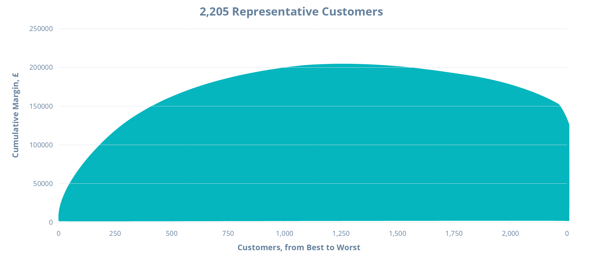
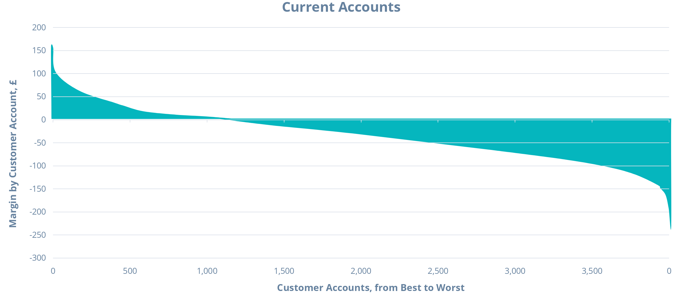
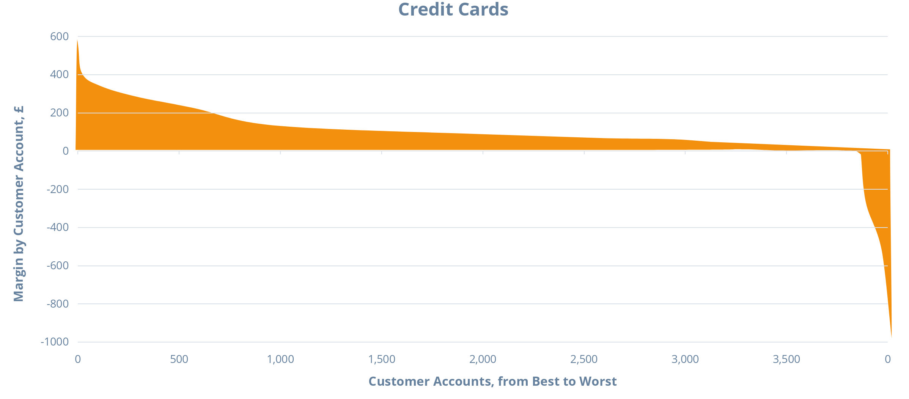
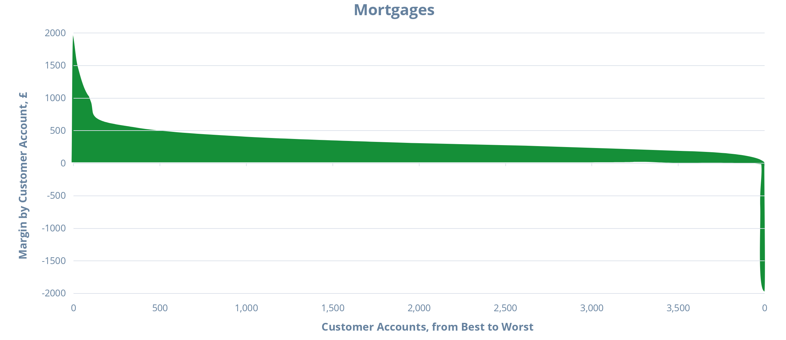
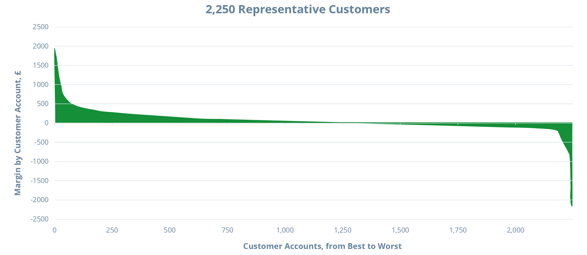

# Strategic Cost Management& New Technologies

# Prof. Mario Milone								MGT(P)495

# Session 5Pricing Decisions

# Outline

* Pricing Decisions
  * Cost\-Plus Pricing
  * Target Pricing
* Customer Profitability

# Pricing Decisions

# What impacts pricing decisions?

* Think of Porter's 5 forces \( __Competition__ \)
  * Competition intensity
  * Threat of new entrants
  * Threat of Substitutes
  * Bargaining power of Customers
  * Bargaining power of Suppliers
* And think of __Costs__

# Cost-Plus Pricing

Not based on market  but based on costs

Usually adds a markup to the cost given by the cost system

Usually used as a starting point

Apart from a few exceptions\, the markup component will eventually be driven by the market

* Different methods to determine the markup \(a few examples\)
  * Target a rate of return on investment
  * Choose a cost base to apply a markup to
    * Variable Manufacturing cost
    * Variable cost
    * Total manufacturing cost
    * Full Cost

# Cost-Plus Pricing - Target ROI

# Cost-Plus Pricing

* Instead of targeting ROI\, you can use a base to add the markup to
* Most managers use Full Cost when doing cost\-based pricing
* Makes more sense when making a pricing decision in the long\-run
  * Otherwise\, runs the risk of not being profitable
  * Note that it relies on the accuracy of the costing system
* Using variable costs as a base may be dangerous
  * Incentives to cut prices and not recover the fixed costs associated with production\.

# Target Pricing and Target Costing

Target pricing is market based

Prices are estimated using the customer's willingness to pay

Relies heavily on the understanding of customers and the competitive environment

# Target Pricing and Target Costing - Steps

Develop the product using customer knowledge

Choose the Target Price

Decide on a Target Operating Income

Derives the Target Cost that satisfies the price and operating income

Analyze your costs and achieve Target Cost

# Target Pricing and Target Costing

# Cost-Plus VS Target Pricing

Cost\-Plus pricing provides _prospective_ prices

Does not take into account competitors' reaction to prices or customers' preferences

Target pricing tries to already incorporate information about competitors and customers

It reduces the amount of subsequent revisions that has to be done

* Cost\-Plus pricing is used more for
  * Commodity services with low barrier to entry and high competition
* Target\-Pricing is used more for
  * High value\-added services
  * Examples: consulting\, logistics\, \.\.\.

# Example:Sheridan Carpet Company

# Sheridan - Background

Produced high\-grade carpeting materials for use in automobiles and vans

Sold products to finishers

Largest company in its segment

* We focus on carpet 104
  * Difficult to produce \(denser nap\)
* Late 1982: decision on the list price of carpet 104
  * Needed to bring 104's margin up to that of other carpets
  * Usually competitors have adhered to their announced prices within 6\-months unless significant changes in costs
* Sheridan is a price leader

# Prices and Production

* Sheridan increased their prices but not the competitors
* Loss of market share
* Marketing Manager estimated that the industry would sell about 630\,000 square yards of these carpets in the first half of 1983
* His analysis was
  * Could sell 150\,000 yards if drop the price back to $3\.90
  * Could sell at least 65\,000 yards at the $5\.20 price

# Pricing Decision - Concerns

* Concerns of an erosion in Sheridan's share price if price held at $5\.20
* Would the competitors announce a further price decrease if Sheridan dropped the price back to $3\.90?
  * Maybe not as Sheridan believes to be very efficient
* Would the pricing decision have any impact on the sales of Sheridan's other carpets?
  * Maybe not as 104 is a specialized product

# Estimated Costs per Volume

# Pricing Decision

* Should Sheridan lower the price to $3\.90?
* What information is relevant?
  * Forecast: Volume is 65\,000 at $5\.20
  * Forecast: Volume is 150\,000 at $3\.90
* What is the underlying assumption?
  * Competitors stay at $3\.90

* How should we approach the problem?
* Contribution analysis?
  * Look at variable costs
* Full cost approach?
* Competitor Analysis

# Contribution Analysis

Sheridan should price 104 at $3\.90 to maximize total profits

# Breakeven Analysis

If Sheridan keeps the price at $5\.20\, how much should it sell to be better off than selling 150\,000 sq\.yd\. at $3\.90?

$335\,850 / $3\.46 = 97\,000 sq\.yd

# Full-Cost Analysis

Directly use the data on costs per volume

Full cost always greater than $3\.90 up to 185\,000 sq\.yd\.

Under the Full Cost view\, $3\.90 does not recover costs

Selling at $5\.20 minimizes the loss

# What should we do?

* Arguments supporting the contribution analysis
  * Fixed costs are irrelevant for short\-term decisions
  * In a fixed\-cost approach\, some fixed costs are treated as if they were variable
* Arguments supporting the full cost approach
  * Marginal cost pricing does not make profits
  * Fixed costs are relevant in the long\-term
  * Fixed cost must be covered\, so why not charge them in the pricing?
* When does the short\-term ends and the long\-term begins?
  * Some decisions have more long\-term rather than short\-term implications

# Competitor Analysis

Pricing decisions involve other players \(competitors\)

They are influenced by our pricing decisions

It is important to anticipate the competitor's actions

Pricing decisions are strategic decisions

How do we incorporate competitive reactions to our pricing decisions?

* What is best for Sheridan?
  * Price the carpet at $5\.20
  * Competitor move up the price to $5\.20
* What would be Sheridan's market share in that case?
  * Best case: 35% as it was before \(sell 220\,500 sq\.yd\)
  * Worst case: 24% if sells 150\,000 \(150\,000/630\,000\)

# Sheridan's Profits

# Competitors' Profits

Competitors seem to be better off at $5\.20 as well

If they are rational\, they should increase the price to $5\.20

# Competitor Analysis

* What should Sheridan do?
  * Stay at $5\.20
* Why?
  * Very likely that competitors increase the price to $5\.20
  * Competitors are better off at $5\.20
  * $3\.90 does not cover Sheridan's full cost and is unlikely to cover competitors full cost as well
  * Market is growing and competitors may not be able to absorb enough demand

* Was it a good decision for Sheridan to cut the price in 1981?
* Probably not
  * Competitors likely to meet the low price \(they did\)
  * Demand for 104 is linked to demand for cars \(unlikely to change the demand by changing the price\)
  * Price war induced by cut in price
  * No profit at $3\.90

# Customer Profitability

# Customer Profitability Analysis

* Process of allocating revenues and costs to customers
  * Can be customer segments or individual customer accounts
* The profitability of those segments / accounts can then be calculated
* It helps
  * Identify profitable and less profitable customers
  * Link products and customers

Captures the consequence of cross\-selling

Captures profitability variations within each product line

Focuses on customer relationship management

* Improve benefits both at the corporate and individual customer level
* Provides insights in terms of
  * Costs
  * Revenues
  * Risk
  * Strategic positioning
* Useful for marketing decision making as well

# ExampleInfinity Bank

# Infinity Bank

* One of the top ten biggest banks in the UK
* Offers 3 main products
  * Current Accounts \(CA\)
  * Credit Cards \(CC\)
  * Mortgages \(M\)

* Failed to adapt to the changes in UK retail banking environment
  * Pre\-tax profits declined compared to competitors
* Current accounts were unprofitable
* Under\-performing branches
  * Branch managers did not know which customers and products were profitable

* Infinity bank performed a product\-profitability studyfor
  * Current Accounts
  * Credit Cards
  * Mortgages

# Infinity Bank - Current Accounts

# Infinity Bank - Credit Cards

# Infinity Bank - Mortgages

# Infinity Bank - Customer Profitability

* Infinity bank decided to do a customer profitability study
* Sampled 1\,000 customers for each category of products cross\-holdings
  * Customer Profitability in 2003 = Net Revenues \- Service Costs
  * No corporate\-level fixed OH allocations

This is called the Whale Curve of Cumulative Profitability\. Very Typical\.

# Credit-Card Account Averages

# Sources of Variation in Customer Prof.

Different revenue drivers and cost drivers

Some customers holding multiple products\, mostly CA\+CC\, were still unprofitable

The majority of customers with a low profit / loss  do not have a mortgage

At very high levels of profitability\, all customers have a mortgage with large balance

# How should we use this information?

* Improve cost allocation
* Devise appropriate marketing strategies\. Examples are
  * Encourage CA holders to cross\-holdings \(promotional offers\)
  * Promote the most profitable customers to attract new customers

# Takeaways - Customer Profitability

Product or service profitability is not enough

Need to take into account the customer lifetime value

Go after competitors' high\-profit customers

Analyze the benefit of expensive customers

Take actions to improve customer profitability

