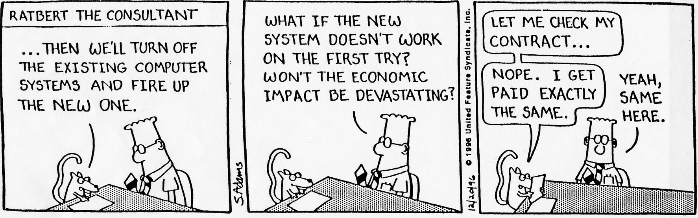

# Strategic Cost Management& New Technologies

# Prof. Mario Milone								MGT(P)495

# Session 8Control and Performance Evaluation

# Outline

* Performance Measures
  * Financial VS Non\-Financial
  * Accounting\-based Measures
* Control and Accountability
  * Span of Control
  * Span of Accountability
* Incentive Compensation

# Performance Measures

# Financial VS Non-Financial

* Remember our class on the Balanced Scorecard
  * Non\-financial measures lead financial measures
  * Allows to articulate the strategy and come up with appropriate measures
  * Non\-financial measure allow to make improvements in the Learning\-and\-Growth perspective

# Non-Financial Measure

# Accounting-based Measures

Operating Profits / Income

Return on Investment \(ROI\)

Residual Income \(RI\)

Economic Value Added \(EVA\)

# Operating Profits / Income

* Pros
  * Very easy to calculate and comparable
  * Well understood
* Cons
  * Not always representative of cash flows
  * Manipulable in the short\-term
  * Macro factors are uncontrollable

# Return on Investment (ROI)

# DuPont decomposition

* This decomposition helps understand how ROI can be increased
  * Decrease assets while keeping revenues and profits constant
  * Increase revenues \(using the assets better\) keeping income per revenue constant
  * Decrease costs while keeping revenues and assets constant

# Return on Sales (ROS)

ROS is a component of ROI in the DuPont decomposition

Can be used as a separate performance measure

ROS measures how effectively companies manage costs

# Residual Income (RI)

* Always think about risk\!
* What is the rate of return associated with a business which faces similar risk?
  * Can look at comparable companies
  * And use CAPM to compute the required rate of return
  * Don't forget to take into account leverage when you do that\!
* Linked to IRR when making investment choices

# ROI vs RI

* RI is a dollar amount instead of a ratio
* Using ROI as a performance measure can lead to reject profitable projects
  * As it increases the denominator \(Investment\)
  * Particularly if the manager heads a profitable division

* These are general results
* The new ROI is a weighted average of the current ROI and the ROI of the project
  * Any new project below the current ROI will be rejected by the manager
  * Even if it provides a return higher than the required rate of return
* Being a dollar amount\, RI aggregates linearly
  * Any new project's RI will add to the current RI

* RI can be sensitivity to assumptions on the required rate of return
* Consider 2 divisions
  * Division 1: Investment base of $1000 and Income of $200
  * Division 2: Investment base of $5\,000 and Income of $750

# Economic Value Added (EVA)

* Meant to capture the economic value creation
* Allows the incorporation of the cost of capital at the company level
* Charges managers for the cost of investment in Long\-Term assets and Working Capital
* Typical EVA compensation scheme:
  * Tied to both EVA and change in EVA
  * Often no cap on the upside potential
  * Bonus Bank \(adjust for negative declines in the future\)

Example:

Income Tax Rate: 30%\, Before Tax Operating income: $250\,000

Compute the EVA

# Control and Accountability

# Span of Control

* Resources the __manager controls__ to accomplish the task she/he is responsible for\.
* Resources directly controlled by the manager
  * Headcounts
  * Budget allocations
  * Balance Sheet Assets
  * \.\.\.

# Span of Accountability

* Range of __performance measures__ used to evaluate the manager's achievements
* Could be narrow \(few trade\-offs to consider\) or very large
  * Responsible of operating expenses \(narrow\)
  * Market value of the firm \(large\)

Competitive Position

Return on Capital Employed

Customer Satisfaction

P&L \+ Current Assets

Product Reliability

Manufacturing Costs

Operating Expenses

# Controllability Principle

The controllability principle suggests that expected performance should depend on what can be controlled by the manager

That is\, when someone is given authority \(or control\) over resources\, they should be responsible \(or accountable\) for the performance of those resources

Let's look at what it means in terms of Span of Control and Span of Accountability

# Line of Sight

When Span of Control = Span of Accountability\, we call this "Line of Sight"

Managers are responsible only for what they can control

Few resources					     Span of Control			               Many Resources

Few Trade\-Offs			         Span of Accountability	                       Many Trade\-Offs

# Accountability > Control

Most jobs are not perfectly aligned

Often\, Span of Accountability is wider than Span of Control

Few resources					     Span of Control			               Many Resources

Entrepreneurial Gap

Few Trade\-Offs			         Span of Accountability	                       Many Trade\-Offs

* Does this seem fair?
* In these situations\, employee is forced to find creative ways to meet her/his goal
  * Increases innovation

# Incentive Compensation

# Incentive Compensation - Outline

Performance Pay

Control

Stock VS Options

Severance Pay

# Incentive Compensation

How to motivate effort?

How can we think of this problem using a theoretical framework?

Does the difference between the Span of Control and Span of Accountability matters for compensation?

# Performance Pay

How to motivate effort?

Assume the maximum punishment is to pay nothing

Punish the manager in case of the low outcome

* Bonus compensation increases with
  * The cost of effort
* Bonus compensation decreases with
  * The impact the manager has on outcome by exerting effort

# Span of Control and Accountability

* For example\, what happens when using stock compensation?
  * Problem: Managers may have little control over firm overall performance\.
  * How can we understand the implications in terms of compensation?

# How about using stock as compensation?

# How about using stock options?

# Stock Options and Risk-Taking

OK\, so stock options encourage effort

But they also encourage risk\-taking

Expected Profits of the high\-risk investment

Expected Profits of the low\-risk investment

# Severance Pay

* Is severance pay detrimental to shareholders?
  * If so\, why?
  * If not\, why not?
* Potential disadvantages:
  * Pay for poor performance: may dilute incentives
* Potential benefits:
  * May induce the revelation of bad news
  * Or induce risk\-taking

* How do we model these effects?
  * Interpret the effort as an investment in firm specific human capital
  * The CEO is either a good fit or a bad fit for the firm
  * If the CEO works\, she will be more likely a good fit
  * If she is bad\, she should be replaced
* Problem: Only the CEO observes whether she is a good or bad fit
* How to induce effort and revelation of information?

Zero Compensation

Announces "good"

Replaced / Possible Severance Pay

Zero Compensation

Announces "good"

Replaced __\+ Severance Pay__

* In this setting\, severance pay:
  * Induces the CEO to reveal bad news
  * Improves CEO turnover
  * Does not dilute effort incentives if chosen optimally
  * Cost of the incentive scheme remains unchanged

# Takeaways

Multiple financial performance measures

Span of Control VS Span of Accountability

How to think about incentive compensation

