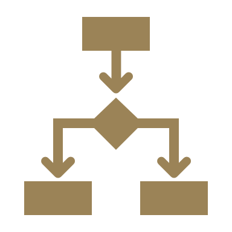
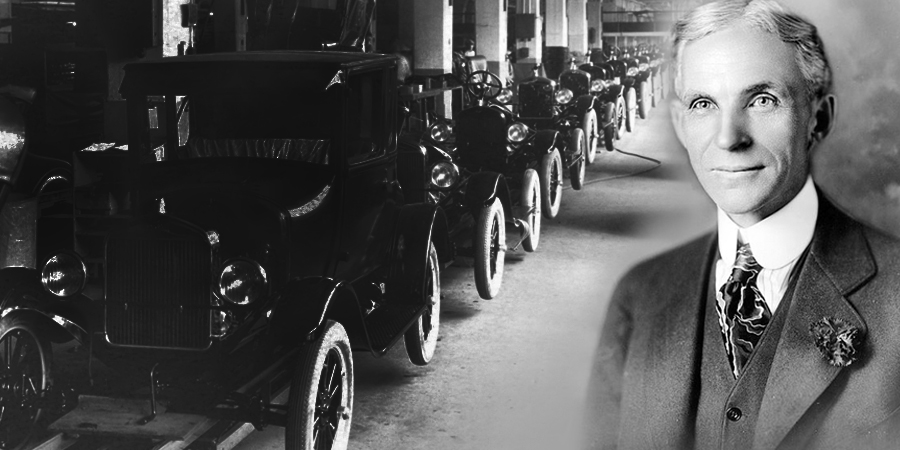
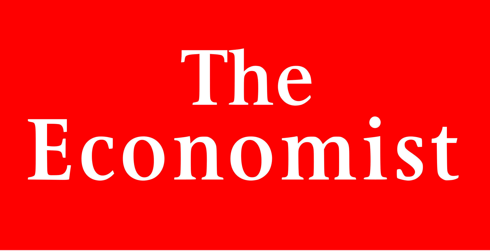
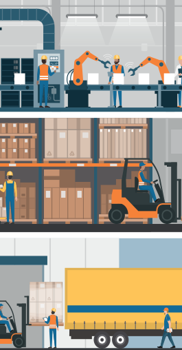
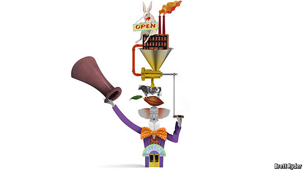

# Strategic Cost Management& New Technologies

# Prof. Mario Milone								MGT(P)495

# Session 9Transfer Pricing

Part I

# Outline

* Vertical Integration
* Transfer Pricing
  * Cost Based
  * Market Based
  * Minimum Transfer Price

# Vertical Integration

# Why do firms vertically integrate?

* To gain control over scarce resources
  * Boeing tried to outsource 70% of its 787and it was a disaster\.
  * Parts came in late and did not fit together\.
  * 6\,000 components\, many failed to conform to Boeing's specified engineering tolerances\, resulting in significant cost and delays\.
  * Record number of orders but delivery date was pushed back four times\.

* To avoid Holdup issues
  * Fisher Body had an exclusive contract wit GM to supply car body parts
  * Fisher Body was the only company to deliver the components according to GM's specifications
  * In 1920\, a sharp increase in demand occurred \(above expectations\)
  * It is claimed that Fisher Body used the unforeseen situation to holdup GM by increasing the price for the additional parts produced
  * It has been said that this led GM to acquire Fisher Body in 1926
  * Note: This example is strongly disputed by Coase \(2005\)\.

# Vertical Integration

* Vertical integration was very common a century ago
  * _"If you want to do it right\, do it yourself"_ \- Henry Ford
* Best vertical integration examples in the 1970\-1980 are from the oil industry
  * BP and Shell cam to control every step involvedin bringing a drop of oil
  * from Alaska to a vehicle's fuel tank

# Dell's Virtual Integration

The idea of vertical integration was taken a step further by Dell Computer\, one of the most successful companies of the 1990s\. Michael Dell\, its founder\, said that he combined the traditional vertical integration of the supply chain with the special characteristics of the virtual organization to create something that he called “virtual integration”\. Dell assembles computers from other firms’ parts\, but it has relationships with those firms that are more binding than the traditional links between buyer and supplier\. It does not own them in the way of the vertically integrated firm\, but through exchanges of information and a variety of loose associations it achieves much the same aim – what Michael Dell calls “a tightly co\-ordinated supply chain”\.

# 1990 - 2010: Lean Manufacturing

* In the late 1990s\, consultants McKinsey & Company wrote:
  * _Whereas historically firms have vertically integrated in order to control access to scarce physical resources\, modern firms are internally and externally disaggregated\, participating in a variety of alliances and joint ventures and outsourcing even those activities normally regarded as core\._
* … for the past 30 years firms have been focusing on their core business and contracting out everything else to specialists\. Steelmakers sold their mining operations and carmakers spun off their parts suppliers\. Controlling it all made sense\, the argument went\, _when markets were rudimentary: when supplies of vital materials were limited or contractors could cheat you_ \. As markets became more sophisticated these justifications fell away\. Thanks to globalization\, companies could always find new resources and better suppliers\.

# The latest trend: 2010 -

APPLE and Tesla are two of the world’s most talked\-about companies\. They are also two of the most vertically integrated\. Apple not only writes much of its own software\, but designs its own chips and runs its own shops\. Tesla makes 80% of its electric cars and sells them directly to its customers\. It is also constructing a network of service stations and building the world’s biggest battery factory\, in the Nevada desert\.

Elon Musk’s SpaceX believes the key to innovation and dramatically lower costs is to do as much as possible in\-house and avoid the unwieldy multilayer supply chains and “cost\-plus” billing used by its competitors\. It builds everything from components to its rocket engines in\-house at an integrated manufacturing facility in Los Angeles\.

# Simplicity and well integrated products command a premium

Reasons for the reversal abound\, but five stand out\. The most important is simplicity \. Consumers are willing to pay a premium for well\-integrated products that do not force them to deal with different suppliers or land them with components that do not talk to each other\. They want to be able simply to press a button and let the machine to the rest\. This is largely why Apple opted for integration\, as did Nest\, a maker of wireless thermostats\.

# If you are at the tech frontier, you may find no suppliers

A second reason is that firms operating on the technological frontier often find it more efficient to do things in\-house\. Companies that are inventing the future frequently have no choice but to pour money into new ventures rather than buy components off the shelf\. This explains Tesla’s “gigafactory” for batteries: their availability is the biggest constraint on the firm’s growth\.

# Speed

Choice is reinforced by speed : fashion brands such as Spain’s Zara have resisted contracting out everything\. Instead\, they operate their own clothes factories\, employ their own designers and run their own shops\. This gives them a big advantage: they can turn the latest trend into new product\, often in small batches\, and have it in stores in a couple of weeks\. Less vertically integrated brands such as Gap and American Apparel find they are stuck with yesterday’s creations because they cannot get supply chains to produce new wares quickly\.

# Decentralization

Vertical integration does not always imply centralization

\(De\)centralization requires a transfer pricing policy

# Transfer Pricing

# Objectives of Transfer Pricing

* Transfer prices serve multiple purposes in vertically integrated companies with multiple divisions \(Profit Centers\)
  * Segment profitability measurement
  * Determine tax liabilities in different countries
* Note: Transfer prices used for internal \(managerial\) purposes need not \- and generally are not \- the same ones used for tax purposes\.
  * Multiple sets of Books

# Transfer Pricing

* Main points of transfer pricing:
  * Transfer prices __split__ the overall corporate profit among business segments / division
  * Good transfer pricing rules __incentivize__ divisional managers to make decisions in the overall corporate interest
  * __Goal Congruence__ \(division managers act in the best interest of the company\)

U

Upstream

Division

The transfer price \(TP\) becomes an __expense__ in the income statement of the Downstream Division \(D\) and a __revenue__ in the income statement of the Upstream Division \(U\)

D

Downstream

Division

Intermed\. Product: q

Transfer Price: TP

# Transfer Pricing Methods

Cost\-Based transfer prices

Market\-Based transfer prices

Minimum transfer price

# Cost-Based Transfer Pricing

* Transfer prices are derived from the cost incurred by the supplying division delivering the intermediate product\.
* Decision on quantity to be transferred typically made by the buying __downstream__ division\.
  * Pull System
* Common cost\-based transfer prices include:
  * Full cost
  * Variable cost
  * Full \(orVariable\) cost plus mark\-up

# Illustration: Megabuck

Megabuck Inc\. has an Upstream Division that transfers an intermediate product to the Downstream Division\, which then completes and sells the final product\.

Each unit of the final product requires one unit of the intermediate product plus other inputs \(sourced by the Downstream Division\) resulting in a unit variable cost of $4 per unit

U

Upstream

Division

D

Downstream

Division

Intermed\. Product: q

Transfer Price: TP

FC: 4\,000

UVC: 5

Suppose the buying division cannot obtain the intermediate product on the outside\.

Assume the Transfer Price TP = $6

How much units would the downstream division demand ?

Would the full cost of the selling division be covered?

The full cost of the selling division \(downstream\) are covered\.

Is this policy consistent with Full Cost Transfer Pricing?

What if we use Variable Cost Transfer Pricing?

Under variable cost\, the transfer price is equal to the variable cost per unit of the upstream division \($5\)

When TP=$5\, Downstream chooses 4\,500 units as its marginal cost is now $9

D internalizes the same marginal cost as the firm\, so its incentives are aligned\.

# Cost-Based Transfer Pricing

* Advantages of cost\-based TP: It can be optimal when TP = Unit Variable Cost
* Issues with cost\-based transfer pricing
  * Weak incentives to cut cost
  * Incentives to over report costs
  * Induces double marginalization under Full Cost\+

# Transfer Pricing

_"The economist's first instinct is to set the transfer price equal to marginal cost \(Hirschleifer\)\. But it may be difficult to find out marginal cost\. As a practical matter\,_  _marginal cost information is rarely known to anybody in the firm\, because it depends on opportunity costs that vary with capacity use_  _\. And even if marginal cost information were available\, there is no guarantee that it would be revealed in a truthful fashion for the purpose of determining an optimal transfer price\."_

\- Holmstrom and Tirole 1991

# Market-Based Transfer Pricing

* In the presence of "functioning" external markets\, many firms take the external market price as a benchmark for their internal transfer price\.
* Generally\, the external market price provides a ceiling not to be exceeded by the internal transfer price\.
* Decision on quantity to be transferred typically rests with the buying __downstream__ division\.
  * Pull System

Following our example\, suppose the Upstream Division can sell any quantity\, up to its capacity limit of 7\,000 units\, as a unit price of $7 to Outside Corp\.

Will a policy of setting the internal transfer price at $7 achieve goal congruence?

* Following our example\, suppose the Upstream Division can sell any quantity\, up to its capacity limit of 7\,000 units\, as a unit price of $7 to Outside Corp\.
* Will a policy of setting the internal transfer price at $7 achieve goal congruence?
* Yes
  * The marginal cost of an internal transfer becomes $7 \(opportunity cost\)
  * TP=$7 aligns the incentives of D and those of the firm

Note: it assumes that the outside market is "functioning"\, in the sense of __competitive market__

If the market is imperfectly competitive\, the external price may be too high and the downstream division may decide not to purchase the intermediate good\.

In this situation\, the transfer price must generally be set below the external market price

Companies frequently impose intra\-company discounts

* Advantages of market\-based transfer pricing:
  * Objective and reliable
  * Provides incentives to cut cost
  * It may induce goal congruence if the market for the intermediate good is competitive
* Issues with market\-based transfer pricing:
  * Price may fluctuate over time
  * Sometimes there is no market for the intermediate product
  * The price of the intermediate product may not be competitive if U has market power

# Minimum Transfer Price

* Textbooks in managerial accounting frequently advocate a " __Minimum Transfer Price__ " which calculates the transfer price as the sum of:
  * __Incremental Cost__ of providing the intermediate product
  * __Opportunity Costs__ for the selling division \(e\.g\. contribution margin foregone on external sales\)

Let's continue our example

Suppose Upstream can sell a modified version of the intermediate product externally for $8 after incurring an additional variable cost of $1 per unit \(beyond the initial $5\)

What is the transfer price according to the minimum rule?

* What if there is no capacity limit?
  * MTP = 5 \+ \(8\-1\-5\) = $7
* What ifthe maximum quantity the firm cansell externally is 4\,000 units?\(remember the maximum production capacity is 7000\)
  * Then MTP is $5 for the first 3\,000 units\, and $7 for all units beyond 3\,000\.
  * If D sells 5\,000 unitsto U\, the average transfer price under MTP is 3/5\*$5\+2/5\*$7
* MTP helps combine Variable\-Cost TP and Market\-Based TP

# Negotiated Transfer Pricing

* Under this approach\, the divisional managers are free to enter into any mutually agreeable arrangement\.
* They would typically report to the controller:
  * "We have agreed to transfer q widgets in exchange for an overall transfer payment of $X"

# Takeaways

* Full cost is a popular TP policy
  * But it can lead to __double marginalization problem__
* MTP is optimal\, but to know what the MTPis\, we need to understand
  * Market Power in upstream and downstream markets
  * Capacity constraints
* For example
  * If no upstream outside market: 					MTP=Variable Unit Cost
  * Ifnotperfectly competitivemarket andno capacity constraints: 		MTP=Variable Cost
  * If upstream market is competitive and there are capacity constraints:	MTP=MarketPrice

