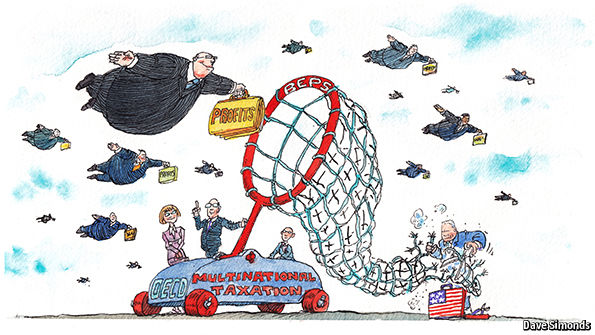

# Strategic Cost Management& New Technologies

# Prof. Mario Milone								MGT(P)495

# Session 10Transfer Pricing

Part II

# Outline

International Taxation

Shifting Income via Transfer Prices

Transfer Pricing Methods for Tax Purposes

# Transfer Pricing for Tax Purposes

Why does it matter?

Transfer pricing not only determine how the pie \(total profit\) is divided among responsibility centers\, it also changes the __size of the pie__ \.

Over a third of all global trade takes place __within__ firms\.

# International Taxation

* OECD Rules for Taxing Multinational Firms:
  * Entity Principle: Income taxed in a particular country based on taxable income of local entity
  * No consolidation
* Common approach: __Territorial Taxation__ \(UK\, Germany\, Japan\, \.\.\. and most OECD countries\)
* A few countries: __Taxation of Worldwide Income__ \(Mexico\, South Korea \.\.\.\)

# Worldwide Corporate Tax Rates

# How about the US?

* __Old US tax system__
  * Consider a U\.S\. multinational firm with operations in Ireland
  * Income is taxed when repatriated to the U\.S\.

* __Old US tax system__
  * If dividend
  * Total Tax Paid = $35

* __Old US tax system__ \(Deferral\)
  * If no dividend
  * Total Tax Paid __Today__ = $15

# Offshore Corporate Earnings

* Example of Apple
  * Corporate profits based on software developed in the U\.S\.
  * The software was shifted to Bermuda using a technique called cost\-sharing\, approved by the IRS\.
  * Once a product is developed\, Apple could share the profits with the Bermuda subsidiary\.
  * Apple then set up 2 Irish companies\, one of which employed actual people\.
  * In between the 2 companies\, Apple set up a Dutch Company\.
  * The profits from the sales of Apple products outside the U\.S\. were attributed to the operating Irish company\, but then shifted via the Dutch company to Bermuda\, which does not tax those profits\.
  * Apple accumulated $128 billion in Bermuda with an effective overall tax rate below 5%\.

# Tax Cuts and Job Act of 2018

* New U\.S\. corporate tax rate of 21%
* Notax on dividend repatriations
* Tax Act supporters point out 2 provisions designed to counter the incentives to shift:
* Global Intangible Low\-Taxed Income \(GILTI\)
  * Profits in excess of 10% return on offshore tangible investments are taxed at 10\.5%
  * Trying to target return on intangibles \(like IP\)
* Foreign Derived Intangible Income \(FDII\)
  * Very similar than GILTI

# How about the US?

* __New US tax system__
  * Consider a U\.S\. multinational firm with operations in Ireland
  * Income is __not taxed__ when repatriated

* __Old US tax system__
  * If dividend
  * Total Tax Paid = $15

# Shifting Income via Transfer Prices

Foreign Subsidiary

Interm\. Product q

Transfer Price TP

tf: low tax rate

cf: unit costs

td: high tax rate

# Example

* Let us consider the manufacturing of a mini\-computer
  * South Korean plant assembles the computer
  * U\.S\. plant packages and distributes the computer

* Assume 2 possible transfer prices for the computer
  * Market Price
  * Or 300% of Variable Costs

For the whole firm\, we have

Using a TP of 300% of VCwould reduceoverall profits

# What is Admissible for Tax Reporting?

Section 482 of the IRS code states the "Arm's Length Principle"

_"Section 482 places a controlled taxpayer on a tax parity with an uncontrolled taxpayer by determining the true taxable income of the controlled taxpayer in a manner that reasonably reflects the relative economic activity undertaken by each taxpayer_  _"_

That says it all\, right?

* For tangible property\, the allowable methods in the U\.S\. include:
  * Comparable Uncontrolled Price \(CUP\)
  * Cost\-Plus
  * Comparable Profit Method \(CPM\)

# Comparable Uncontrolled Price (CUP)

* Find Comparable Transactions with or between __uncontrollable__ parties\.
  * Difficult\!
  * Need to asses the functions performed and the risks assumed by the different parties\.
* No adjustment to TP if the prices are within a range established by 2 uncontrolled transactions\.

CUP is the method of choice

Usually the first question from tax authorities: Did you use CUPs?

Problem: Very hard to find true comparabletransactions

Cost\-Plus has become the default after CUP

# Comparable Profit Method (CPM)

This method uses profits indicators\, such as operating margin\, as a test to determine if cost\-plus meets arms\-length criteria

Identify some comparables \(e\.g\. 10 companies\)

Rank order them from lowest to highest \(by operating margin for instance\)

Exclude the outliers \(e\.g\. the top 2 and the bottom 2\)

The middle 6 is know as the "arm's length range"

If your operating margin is within this range\, you are almost certainly OK

# How many books?

* Some MNEs want to retain flexibility in using internal transfer prices to improve operating performances
* Arguments for "two sets of books"
  * Internal transfer prices should reflect the __economics__ of intra\-company transfers rather than __statutory tax requirements__
  * Transfer prices acceptable for tax purposes frequently reflect __past__ rather than __current__ data

# E&Y Survey in 2000

_“Part of the problem is that each operating group is compensated in accordance with their respective country’s profit and this may conflict with transfer pricing prescriptions in the jurisdictions\.”_

_“We’ve overcome the difficulties \(in incentives and performance measurement\) by the accounting methods used for management incentives\, i\.e\. bonuses\.  We run two sets of books; one for statutory accounting and one for management reporting\.”_

_“It is difficult to measure the role of sales and manufacturing units while optimizing tax issues…\. We have\, for almost a year\, been applying one system for operating measurement and dealing with \( tax\) transfer pricing issues after\.”_

# How about Intellectual Property?

Business today is increasingly digital\, services\-based and driven by intangible assets\, including rights to exploit intellectual property \(IP\)\, from patents to logos\. These are easier than physical assets to shuffle from subsidiaries in high\-tax countries to those in low\-tax ones\. In short\, they make the old rules easier to game\.

# Transfer of Intangible Property

* Increasingly important for many MNEs\, in particular technology and pharmaceutical companies\, is the transfer of intangible assets
* Example of Intangible Property transferred to foreign subsidiaries
  * Patents\, processes and designs
  * Methods\, programs\, systems\, procedures\, surveys\, forecasts\, estimates\, customer list\, or technical data
  * Copyrights
  * Franchises\, licenses\, or contracts
  * Trademarks\, trade names\, or brand names

# Where to locate the IP?

Intellectual property \(IP\) can be developed anywhere

Cost sharing agreements allocate ownership of IP to specific corporate entities

The corporate entity that owns the IP collects royalties from other corporate entities that use \[sell\] the IP

Tax on profits from the IP are taxed at the prevailing rates in the jurisdiction that owns the IP

# The "IP buy-in"

* Companies can initially incorporate in those jurisdictions that provide beneficial tax benefits
  * Usually expensive and not done until the company has proven technology
* At some point\, the company will "sell" its IP to a subsidiaryto transfer ownership to a tax\-favorable location \- known as the "IP buy\-in"
* This creates a taxable event for the selling company\, but moves the IP to a tax\-favorable location for future profits
* Since the value of IP generally increases over time\, the earlier this is done\, the better

# Takeaways

* Transfer Pricing is Contentious
  * At the firm level: transfer prices affect performance evaluation and\, hence\, the rewards managers receive\. Disputes between divisions are inevitable\.
  * At the country level: every country believes it is being cheated by multinational companies through their transferpricing policies\.

* Example: GlaxoSmithKline \(GSK\)
  * In January 2004\, the IRS files a $5\.2 billion claim \(including $2\.5 billion in interest\) over the transfer prices attributed to Zantac \(ulcers\)\, Zofran \(nausea\)\, Ceftin \(antibiotic\)\, etc\.
  * The R&D had been undertaken in the U\.K\. The products were produces in the U\.K\. and shipped to the U\.S\. The drugs were then marketed and sold by the U\.S\. subsidiary\.
  * The price charged by GSK in the U\.K\. fr drugs exported to the U\.S\. included a charge for services related to the costs of R&D
* The IRS claimed that
  * The charges were excessive
  * GSK ignored the contribution that heavy marketing and sales efforts in the U\.S\. made to the drugs' success

